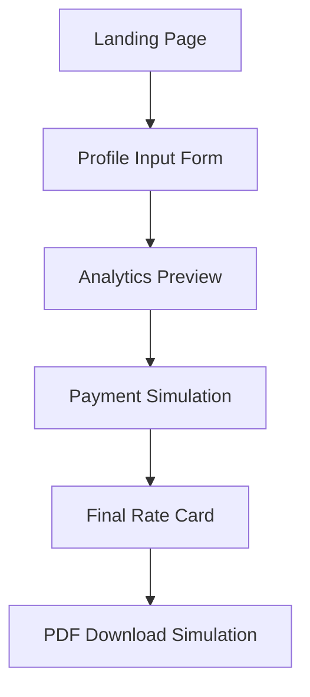

# GenRate Prototype - User Journey Documentation

## Overview

GenRate is a single-page application (SPA) that generates professional rate cards for social media influencers. The application follows a linear user journey with 5 main steps, utilizing mock data and simulated payment processing.

## Technical Architecture

- **Framework**: Vanilla JavaScript with DOM manipulation
- **Styling**: Tailwind CSS via CDN
- **Data Storage**: In-memory JavaScript object (`userData`)
- **Payment**: Simulated Xendit integration
- **File Structure**: Single HTML file with embedded CSS and JavaScript

## User Journey Flow



---

## Step 1: Landing Page

### Purpose
Initial entry point that introduces the GenRate service and encourages user engagement.

### Technical Implementation
- **Function**: `renderLandingPage()`
- **Container**: `#app-container`
- **Event Handler**: Click event on `#get-started-btn`

### UI Elements
- **Header**: "GenRate" (4xl font, extrabold)
- **Tagline**: "Generate professional rate cards for your social media profiles"
- **CTA Button**: "Generate My Rate Card" (indigo-600 background)

### User Interactions
1. User lands on the page
2. Reads the value proposition
3. Clicks "Generate My Rate Card" button
4. Transitions to Profile Input Form

### Code Reference
```javascript
const renderLandingPage = () => {
    appContainer.innerHTML = `
        <div class="text-center p-6 bg-gray-50 rounded-2xl shadow-inner">
            <h1 class="text-4xl font-extrabold text-gray-800 mb-4">GenRate</h1>
            <p class="text-lg text-gray-600 mb-8">Generate professional rate cards for your social media profiles.</p>
            <button id="get-started-btn" class="py-3 px-8 text-lg font-semibold text-white bg-indigo-600 rounded-lg shadow-md hover:bg-indigo-700 transition duration-150 ease-in-out">
                Generate My Rate Card
            </button>
        </div>
    `;
    document.getElementById('get-started-btn').addEventListener('click', renderGeneratorPage);
};
```

---

## Step 2: Profile Input Form

### Purpose
Collect social media usernames/URLs from the user to generate analytics preview.

### Technical Implementation
- **Function**: `renderGeneratorPage()`
- **Form ID**: `#generator-form`
- **Event Handler**: Click event on `#analyze-btn`
- **Validation**: Requires at least one platform input

### UI Elements
- **Title**: "Profile Details"
- **Description**: Instructions about free preview and paid pricing
- **Input Fields**:
  - Instagram Username (text input with placeholder)
  - TikTok Username (text input with placeholder)
  - YouTube Channel URL (text input with placeholder)
- **Submit Button**: "Analyze Profile"

### User Interactions
1. User enters username(s) for desired platforms
2. Clicks "Analyze Profile" button
3. System validates input (at least one field required)
4. Shows loading spinner for 1.5 seconds
5. Transitions to Analytics Preview

### Data Processing
- Stores user input in `userData` object
- Generates mock data using `getMockData()` function
- Creates platform-specific data structures

### Code Reference
```javascript
// Input validation and data storage
if (!instagramInput.value && !tiktokInput.value && !youtubeInput.value) {
    showMessageBox('Please enter at least one username or URL.', 'error');
    return;
}

userData = {
    instagram: instagramInput.value ? { data: getMockData('instagram', instagramInput.value) } : null,
    tiktok: tiktokInput.value ? { data: getMockData('tiktok', tiktokInput.value) } : null,
    youtube: youtubeInput.value ? { data: getMockData('youtube', youtubeInput.value) } : null
};
```

---

## Step 3: Analytics Preview

### Purpose
Display mock analytics data to demonstrate value before requiring payment.

### Technical Implementation
- **Function**: `renderPreviewPage()`
- **Data Source**: `getPreviewCards()` function
- **Mock Data**: Generated by `getMockData()` function

### UI Elements
- **Header**: "Your Analytics Preview"
- **Subtitle**: "This is a summary of your profile's performance. Pricing is hidden."
- **Profile Cards**: Grid layout (responsive: 1 col mobile, 2 col tablet, 3 col desktop)
- **CTA Section**: "Ready to see your pricing?" with unlock button

### Profile Card Components
Each card includes:
- **Profile Image**: Platform-specific placeholder (120x120px)
- **Username**: User-provided username
- **Platform Label**: Instagram/TikTok/YouTube
- **Metrics**:
  - Followers/Subscribers count (10K-150K range)
  - Engagement Rate (2-10% range)
- **Audience Demographics**: Mock demographic data

### Mock Data Generation
```javascript
const getMockData = (platform, username) => {
    const placeholders = {
        'instagram': "https://placehold.co/120x120/5d4090/ffffff?text=IG",
        'tiktok': "https://placehold.co/120x120/000000/ffffff?text=TT",
        'youtube': "https://placehold.co/120x120/FF0000/ffffff?text=YT"
    };
    return {
        profileImage: placeholders[platform],
        followers: (Math.floor(Math.random() * (150000 - 10000) + 10000)).toLocaleString(),
        engagementRate: (Math.random() * (10 - 2) + 2).toFixed(2),
        audience: "60% Female, 40% Male | 25-34 Age Group | Top Locations: Jakarta, Surabaya",
        username: username,
        platform: platform
    };
};
```

### User Interactions
1. User reviews their analytics preview
2. Sees value in the data presentation
3. Clicks "Unlock Full Rate Card (Simulated Payment)" button
4. Transitions to Payment Simulation

---

## Step 4: Payment Simulation

### Purpose
Simulate the payment process before revealing full rate card with pricing.

### Technical Implementation
- **Function**: `renderPaymentPage()`
- **Payment Gateway**: Simulated Xendit integration
- **Event Handler**: Click event on `#pay-btn`

### UI Elements
- **Title**: "Complete Your Payment"
- **Description**: "This is a simulation of the Xendit payment gateway"
- **Payment Button**: "Simulate Successful Payment" (emerald-600 background)

### User Interactions
1. User sees payment simulation interface
2. Clicks "Simulate Successful Payment" button
3. Success message appears: "Payment successful! Redirecting..."
4. 2-second delay before transitioning to Final Rate Card

### Code Reference
```javascript
document.getElementById('pay-btn').addEventListener('click', () => {
    showMessageBox('Payment successful! Redirecting...', 'success');
    setTimeout(renderFinalRateCard, 2000);
});
```

---

## Step 5: Final Rate Card

### Purpose
Display complete rate card with pricing information after successful payment.

### Technical Implementation
- **Function**: `renderFinalRateCard()`
- **Pricing Generation**: `getPricingTable()` function
- **Data Source**: Previously stored `userData`

### UI Elements
- **Header**: "Your Complete Rate Card"
- **Subtitle**: Congratulations message
- **Profile Cards**: Same as preview (using `getPreviewCards()`)
- **Pricing Section**: "Service Pricing" with detailed pricing tables
- **Download Button**: "Download as PDF (Simulated)"
- **Disclaimer**: Legal disclaimer about sample rates

### Pricing Structure
For each platform, generates:
- **Single Post/Video**: $200-$1,000 (random)
- **Story/Short Form**: $100-$400 (random)
- **Package Deal (3 Posts)**: $800-$2,500 (random)

### Pricing Table Generation
```javascript
const getPricingTable = (platform) => {
    return `
        <div class="mt-4">
            <h4 class="text-lg font-semibold text-gray-700 mb-2">${platform} Pricing</h4>
            <div class="space-y-2">
                <div class="flex justify-between items-center bg-gray-50 p-3 rounded-lg">
                    <span class="text-sm text-gray-700">Single Post / Video</span>
                    <span class="text-indigo-600 font-bold">$${(Math.floor(Math.random() * (1000 - 200) + 200)).toLocaleString()}</span>
                </div>
                // ... additional pricing tiers
            </div>
        </div>
    `;
};
```

### User Interactions
1. User reviews complete rate card with pricing
2. Can download PDF (simulated functionality)
3. Journey complete

---

## Technical Components

### Data Management
- **Storage**: In-memory `userData` object
- **Structure**: Platform-based nested objects
- **Lifecycle**: Created during form submission, persists until page reload

### UI Feedback System
- **Function**: `showMessageBox(text, type)`
- **Types**: 'success', 'error', 'info'
- **Behavior**: Auto-dismiss after 3 seconds
- **Styling**: Color-coded based on message type

### Mock Data System
- **Realistic Ranges**: Followers (10K-150K), Engagement (2-10%)
- **Platform Branding**: Color-coded placeholders
- **Demographic Data**: Static but realistic audience information

### Responsive Design
- **Framework**: Tailwind CSS utility classes
- **Breakpoints**: Mobile-first approach
- **Grid System**: Responsive grid layouts (1-3 columns)
- **Typography**: Scalable font sizes and weights

---

## User Experience Considerations

### Positive UX Elements
1. **Progressive Disclosure**: Information revealed step-by-step
2. **Visual Feedback**: Loading states and success messages
3. **Clear CTAs**: Prominent, action-oriented buttons
4. **Responsive Design**: Works across device sizes
5. **Professional Aesthetics**: Clean, modern design

### Potential Improvements
1. **Real Data Integration**: Replace mock data with actual API calls
2. **Form Validation**: Enhanced input validation and error handling
3. **Progress Indicators**: Show user's position in the journey
4. **Back Navigation**: Allow users to return to previous steps
5. **Data Persistence**: Save progress across sessions

---

## Security and Privacy Considerations

### Current State
- No data persistence (client-side only)
- No real payment processing
- No external API calls
- No user authentication

### Production Requirements
- Secure payment processing
- Data encryption
- User authentication
- Privacy policy compliance
- GDPR/data protection compliance

---

## Performance Characteristics

### Loading Times
- **Initial Load**: Single HTML file (~15KB)
- **Step Transitions**: Instant (DOM manipulation)
- **Simulated Delays**: 1.5s for analysis, 2s for payment

### Browser Compatibility
- **Modern Browsers**: Full support (ES6+ features)
- **Mobile Responsive**: Tailwind CSS responsive utilities
- **Accessibility**: Basic semantic HTML structure

---

## Future Enhancement Opportunities

### Technical Enhancements
1. **Backend Integration**: Laravel/Node.js API
2. **Database Storage**: User profiles and rate cards
3. **Real Social Media APIs**: Instagram, TikTok, YouTube APIs
4. **PDF Generation**: Server-side PDF creation
5. **Payment Integration**: Real Xendit/Stripe integration

### Feature Enhancements
1. **User Accounts**: Registration and login
2. **Rate Card Templates**: Multiple design options
3. **Analytics Dashboard**: Historical data tracking
4. **Collaboration Tools**: Share rate cards with brands
5. **Pricing Intelligence**: Market-based pricing suggestions

### UX Enhancements
1. **Onboarding Flow**: Tutorial for new users
2. **Progress Saving**: Resume incomplete applications
3. **Customization Options**: Brand colors, logos
4. **Export Options**: Multiple formats (PDF, PNG, etc.)
5. **Social Sharing**: Share rate cards on social media

---

## Conclusion

The GenRate prototype successfully demonstrates a complete user journey for rate card generation. The linear flow effectively guides users from initial interest to final deliverable, with appropriate value demonstration and payment gating. The technical implementation is solid for a prototype, with clear separation of concerns and maintainable code structure.

The application serves as an excellent foundation for a production-ready service, with clear paths for enhancement in data integration, user experience, and feature expansion.